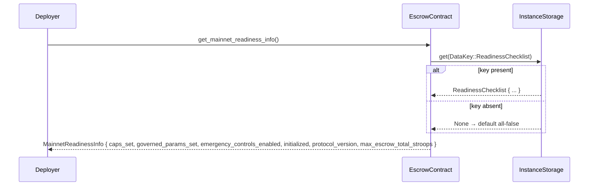
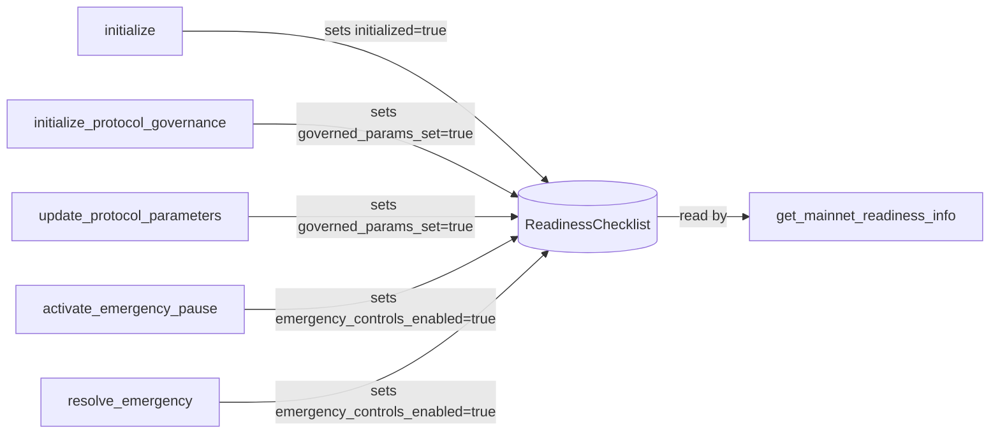

# Design Document: mainnet-readiness-surface

## Overview

The `mainnet-readiness-surface` feature extends the TalentTrust escrow contract with a structured, read-only view function (`get_mainnet_readiness_info`) that returns a `MainnetReadinessInfo` snapshot. This snapshot captures all deployment-critical conditions in a single call: hard caps, governed protocol parameters, and emergency/initialization state.

The feature serves two audiences:
- **Deployers** running preflight scripts before directing production traffic to a newly deployed or upgraded contract.
- **Monitoring tools** that periodically poll the contract to detect configuration drift or unexpected state changes.

The design extends the existing contract without breaking any current behavior. All checklist updates are piggybacked onto existing lifecycle operations (initialize, governance init, parameter updates, emergency controls) so no new mutation surface is introduced.

---

## Architecture

The feature is composed of three tightly coupled pieces:

1. **`ReadinessChecklist` struct** — persisted in `env.storage().instance()` under a new `DataKey::ReadinessChecklist` variant. Tracks four boolean flags that are set to `true` as lifecycle operations complete.
2. **`MainnetReadinessInfo` struct** — the ABI-stable `#[contracttype]` returned to callers. Combines the persisted boolean flags with compile-time constants (`MAINNET_PROTOCOL_VERSION`, `MAINNET_MAX_TOTAL_ESCROW_PER_CONTRACT_STROOPS`).
3. **`get_mainnet_readiness_info` view function** — reads the checklist from instance storage (defaulting to all-false if absent), merges it with constants, and returns the result. No writes, no auth, no events.



### Lifecycle Integration

Each lifecycle operation that satisfies a readiness condition atomically updates the checklist before returning. Because Soroban transactions are atomic, a panic or error before the checklist write means the write never happens — no partial updates are possible.



---

## Components and Interfaces

### New `DataKey` Variant

```rust
#[contracttype]
enum DataKey {
    // ... existing variants ...
    ReadinessChecklist,
}
```

### `ReadinessChecklist` (internal storage struct)

```rust
#[contracttype]
#[derive(Clone, Debug, Eq, PartialEq)]
pub struct ReadinessChecklist {
    pub caps_set: bool,
    pub governed_params_set: bool,
    pub emergency_controls_enabled: bool,
    pub initialized: bool,
}

impl Default for ReadinessChecklist {
    fn default() -> Self {
        Self {
            caps_set: false,
            governed_params_set: false,
            emergency_controls_enabled: false,
            initialized: false,
        }
    }
}
```

### `MainnetReadinessInfo` (public ABI type)

```rust
#[contracttype]
#[derive(Clone, Debug, Eq, PartialEq)]
pub struct MainnetReadinessInfo {
    pub caps_set: bool,
    pub governed_params_set: bool,
    pub emergency_controls_enabled: bool,
    pub initialized: bool,
    pub protocol_version: u32,
    pub max_escrow_total_stroops: i128,
}
```

### `get_mainnet_readiness_info` function signature

```rust
pub fn get_mainnet_readiness_info(env: Env) -> MainnetReadinessInfo
```

- No `require_auth` calls.
- No storage writes.
- No event emissions.
- Never panics (uses `unwrap_or_default` on storage read).

### Helper: `update_readiness_checklist`

A private helper used by lifecycle functions to read-modify-write the checklist:

```rust
fn update_readiness_checklist<F>(env: &Env, f: F)
where
    F: FnOnce(&mut ReadinessChecklist),
{
    let mut checklist: ReadinessChecklist = env
        .storage()
        .instance()
        .get(&DataKey::ReadinessChecklist)
        .unwrap_or_default();
    f(&mut checklist);
    env.storage()
        .instance()
        .set(&DataKey::ReadinessChecklist, &checklist);
}
```

---

## Data Models

### Storage Layout

| Storage type | Key | Value type | Written by | Read by |
|---|---|---|---|---|
| `instance()` | `DataKey::ReadinessChecklist` | `ReadinessChecklist` | lifecycle ops | `get_mainnet_readiness_info` |

All other storage keys are unchanged.

### `caps_set` derivation

`caps_set` is a derived value: it is `true` whenever `MAINNET_MAX_TOTAL_ESCROW_PER_CONTRACT_STROOPS > 0`. Because this constant is fixed in WASM, `caps_set` is always `true` in any deployed build that has the constant defined. The view function computes this inline rather than persisting it, keeping the checklist struct minimal.

```rust
caps_set: MAINNET_MAX_TOTAL_ESCROW_PER_CONTRACT_STROOPS > 0,
```

### Backward Compatibility

When `get_mainnet_readiness_info` is called on a contract instance with no `ReadinessChecklist` in storage (e.g., after a WASM upgrade from an older version), `unwrap_or_default()` returns a zeroed checklist. All boolean fields are `false`. The constant fields (`protocol_version`, `max_escrow_total_stroops`) are always populated from compile-time constants regardless of storage state.

If future versions add fields to `ReadinessChecklist`, older stored entries will deserialize with those fields absent. Soroban's `contracttype` deserialization handles missing fields by using the type's default — so new boolean fields default to `false`, which is the safe/conservative value.

---

## Correctness Properties

*A property is a characteristic or behavior that should hold true across all valid executions of a system — essentially, a formal statement about what the system should do. Properties serve as the bridge between human-readable specifications and machine-verifiable correctness guarantees.*

### Property 1: Fresh contract returns safe defaults

*For any* freshly registered contract instance with no prior lifecycle operations, `get_mainnet_readiness_info` should return a `MainnetReadinessInfo` where all four boolean fields (`caps_set` aside, which is derived from a compile-time constant) are `false`, and the function should not panic.

**Validates: Requirements 2.2, 3.3, 3.4, 5.1**

---

### Property 2: `initialize` sets `initialized` to true

*For any* contract instance, after a successful call to `initialize`, the `initialized` field returned by `get_mainnet_readiness_info` should be `true`.

**Validates: Requirements 2.7, 4.1**

---

### Property 3: Governance mutation sets `governed_params_set` to true

*For any* contract instance, after a successful call to either `initialize_protocol_governance` or `update_protocol_parameters`, the `governed_params_set` field returned by `get_mainnet_readiness_info` should be `true`.

**Validates: Requirements 2.4, 2.5, 4.2, 4.3**

---

### Property 4: Emergency operation sets `emergency_controls_enabled` to true

*For any* contract instance, after a successful call to either `activate_emergency_pause` or `resolve_emergency`, the `emergency_controls_enabled` field returned by `get_mainnet_readiness_info` should be `true`.

**Validates: Requirements 2.6, 4.4, 4.5**

---

### Property 5: `get_mainnet_readiness_info` is idempotent (no writes)

*For any* contract state, calling `get_mainnet_readiness_info` multiple times in succession should return identical results. Because the function performs no writes, repeated calls must not change the returned value.

**Validates: Requirements 3.2, 7.5**

---

### Property 6: `get_mainnet_readiness_info` never panics

*For any* reachable contract state — including a freshly registered contract with no storage, a partially initialized contract, or a fully initialized contract — `get_mainnet_readiness_info` should return successfully without panicking.

**Validates: Requirements 3.3, 5.3**

---

### Property 7: Constant fields always reflect compile-time constants

*For any* contract state, the `protocol_version` field should always equal `MAINNET_PROTOCOL_VERSION` and the `max_escrow_total_stroops` field should always equal `MAINNET_MAX_TOTAL_ESCROW_PER_CONTRACT_STROOPS`, regardless of what is stored in instance storage.

**Validates: Requirements 3.6**

---

### Property 8: Checklist round-trip — lifecycle write is visible in read

*For any* sequence of successful lifecycle operations, the boolean fields returned by `get_mainnet_readiness_info` should reflect all updates made by those operations. Specifically: after `initialize`, `initialized` is `true`; after a governance mutation, `governed_params_set` is `true`; after an emergency operation, `emergency_controls_enabled` is `true`.

**Validates: Requirements 2.3, 3.5**

---

### Property 9: Failed lifecycle operation does not update checklist

*For any* lifecycle operation that fails (panics or returns an error before completion), the `ReadinessChecklist` should remain unchanged — the corresponding boolean field should not be set to `true`. This follows from Soroban's transaction atomicity: storage writes are rolled back on panic.

**Validates: Requirements 4.6**

---

## Error Handling

The readiness surface introduces no new error conditions. The design relies on Soroban's existing guarantees:

- **Absent storage key**: `env.storage().instance().get(...)` returns `None`; the view function uses `unwrap_or_default()` to substitute a zeroed `ReadinessChecklist`. No panic.
- **Lifecycle operation failures**: Soroban transactions are atomic. If a lifecycle function panics before the checklist write, the entire transaction is rolled back. The checklist is never partially updated.
- **Type deserialization**: `#[contracttype]` structs in Soroban use XDR encoding. If a stored entry was written by an older contract version with fewer fields, deserialization of missing fields falls back to the type's default (all-false for booleans). No panic.

There are no new error codes or error variants introduced by this feature.

---

## Testing Strategy

### Dual Testing Approach

Both unit tests and property-based tests are required. Unit tests cover specific examples and edge cases; property tests verify universal invariants across many generated inputs.

### Unit Tests (specific examples and edge cases)

Located in `contracts/escrow/src/test/mainnet_readiness.rs`:

1. **Fresh contract defaults** — register a contract, call `get_mainnet_readiness_info`, assert all boolean fields are `false` (except `caps_set` which reflects the constant).
2. **`initialize` sets `initialized`** — call `initialize`, then assert `initialized == true`.
3. **`initialize_protocol_governance` sets `governed_params_set`** — call governance init, then assert `governed_params_set == true`.
4. **`update_protocol_parameters` sets `governed_params_set`** — call param update, then assert `governed_params_set == true`.
5. **`activate_emergency_pause` sets `emergency_controls_enabled`** — call emergency pause, then assert `emergency_controls_enabled == true`.
6. **`resolve_emergency` sets `emergency_controls_enabled`** — call resolve, then assert `emergency_controls_enabled == true`.
7. **`caps_set` reflects constant** — assert `caps_set == (MAINNET_MAX_TOTAL_ESCROW_PER_CONTRACT_STROOPS > 0)`.
8. **No auth required** — call `get_mainnet_readiness_info` without mocking any auth; assert it succeeds.
9. **No events emitted** — call `get_mainnet_readiness_info`, assert `env.events().all()` is empty.
10. **Failed lifecycle does not update checklist** — trigger a double-initialize (which panics), assert `initialized` is still `false`.

### Property-Based Tests

Use the [`proptest`](https://docs.rs/proptest) crate (already present in the workspace at `contracts/escrow/src/proptest.rs`).

Each property test must run a minimum of **100 iterations** and be tagged with a comment referencing the design property.

**Tag format**: `// Feature: mainnet-readiness-surface, Property {N}: {property_text}`

| Property | Test description | Pattern |
|---|---|---|
| P5: Idempotence | Generate a random sequence of lifecycle ops; call `get_mainnet_readiness_info` twice; assert results are equal | Invariant |
| P6: No panic | Generate random contract states (any combination of lifecycle ops); assert `get_mainnet_readiness_info` always returns | Error conditions |
| P7: Constants | For any contract state, assert `protocol_version == MAINNET_PROTOCOL_VERSION` and `max_escrow_total_stroops == MAINNET_MAX_TOTAL_ESCROW_PER_CONTRACT_STROOPS` | Invariant |
| P8: Round-trip | Generate a random subset of lifecycle ops; execute them; assert each corresponding boolean field is `true` | Round-trip |

Example property test skeleton:

```rust
proptest! {
    #![proptest_config(ProptestConfig::with_cases(100))]

    // Feature: mainnet-readiness-surface, Property 5: get_mainnet_readiness_info is idempotent
    #[test]
    fn readiness_info_is_idempotent(seed in 0u32..4u32) {
        let env = Env::default();
        env.mock_all_auths();
        let contract_id = env.register(Escrow, ());
        let client = EscrowClient::new(&env, &contract_id);

        // Apply a random subset of lifecycle ops based on seed
        if seed & 1 != 0 { let admin = Address::generate(&env); client.initialize(&admin); }
        if seed & 2 != 0 { let admin = Address::generate(&env); client.initialize_protocol_governance(&admin, &10_i128, &4_u32, &1_i128, &5_i128); }

        let first = client.get_mainnet_readiness_info();
        let second = client.get_mainnet_readiness_info();
        prop_assert_eq!(first, second);
    }

    // Feature: mainnet-readiness-surface, Property 7: constant fields always reflect compile-time constants
    #[test]
    fn constant_fields_always_match_compile_time_constants(seed in 0u32..4u32) {
        let env = Env::default();
        env.mock_all_auths();
        let contract_id = env.register(Escrow, ());
        let client = EscrowClient::new(&env, &contract_id);

        if seed & 1 != 0 { let admin = Address::generate(&env); client.initialize(&admin); }

        let info = client.get_mainnet_readiness_info();
        prop_assert_eq!(info.protocol_version, MAINNET_PROTOCOL_VERSION);
        prop_assert_eq!(info.max_escrow_total_stroops, MAINNET_MAX_TOTAL_ESCROW_PER_CONTRACT_STROOPS);
    }
}
```

### Coverage Targets

- All boolean fields exercised in both `true` and `false` states.
- All lifecycle operations that update the checklist covered by at least one unit test.
- Property tests cover idempotence, constant invariants, and round-trip correctness.
